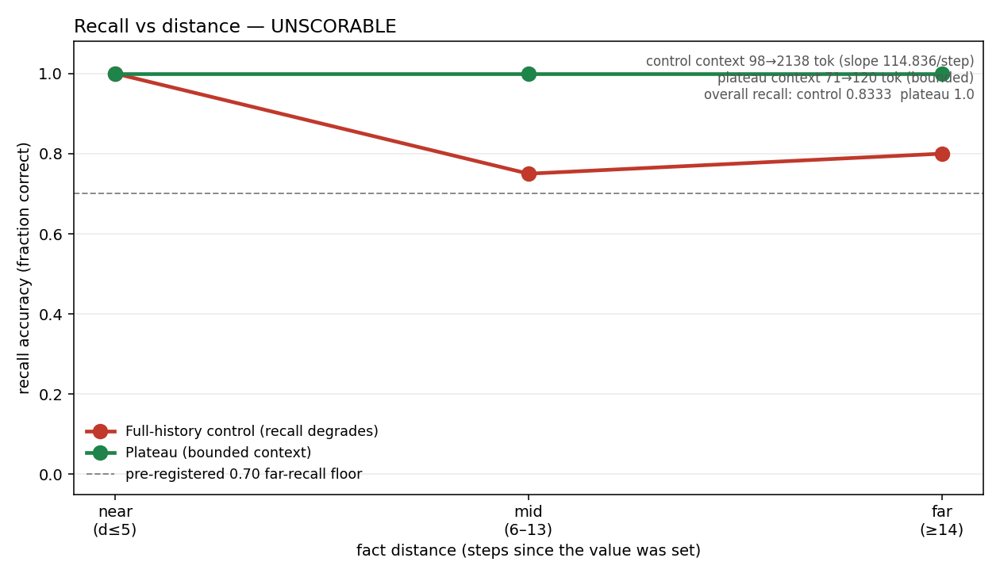

# Plateau

**A bounded-context tool for long-horizon LLM agents.** Instead of replaying the whole
transcript every step, an agent carries a small, re-grounded signal — so context stays flat as
the task grows, and a stored fact stays one short line away.



## The honest headline (stated narrow and true)

**Bounded context at no recall penalty — confirmed on real multi-step code, not just synthetic.**

On a strictly serial ≥5-layer feature built on this repo (the `demo6b` run, isolation-clean), the
full-history arm's context climbed **365 → 37,405 tokens** over six dependent steps (slope
**6,860 tok/step**), while Plateau stayed bounded **508 → 1,075** (slope **103 tok/step ≈ 1.5%** of
full-history — a **66.6× lower** context-growth slope). **Both arms reached PASS with zero rework**
(full-history 32/32 tests, Plateau 36/36): completion parity. Sealed write-once, recompute PASS.
[verdict](demo/verdict6b.json) · [readout](demo/demo6b_readout.md) · all numbers in [`RESULTS.md`](RESULTS.md).

**Cheaper on time too, not just tokens.** The thing that keeps a bounded context honest — re-grounding
every carried fact each step — is sub-millisecond for the shipped gate: a `file_hash` re-ground costs
**~13 µs/fact** (marginal **0.0114 ms/fact**, linear), so re-grounding a 50-fact signal takes **0.59 ms
per step** (gatebench, sealed; classification GATE-CHEAP). The validation overhead is negligible next to
the token savings.

That is the whole claim: **cheaper, not smarter.** Read the next section before believing more.

## What Plateau does NOT do (read this first — it's the credibility)

- **Not a recall *advantage* over full history.** That is the result we went looking for and did
  **not** get. On the head-to-head recall task: `demo2` came out **NULL (near-miss)** — Plateau missed
  its own pre-registered 0.70 far-recall floor by one query — and `demo3`, with the confounds removed,
  came out **UNSCORABLE** because full-history recalled facts *well* from a ~2,000-token transcript
  (far recall 0.80, degrading only 0.20, under our 0.25 anti-rig margin). We publish the NULL/UNSCORABLE
  rather than lengthen the chain until the baseline breaks. [demo2](demo/verdict2.json) · [demo3](demo/verdict3.json)
- **Not a capability or autonomy boost.** In the 3-arm real-workload run (`demo4`), the autonomy arm
  **tied** the efficiency arm (same steps, same zero errors) → **AUTONOMY NULL**. Plateau is an
  efficiency tool at this scale, not a "makes the agent smarter" tool. [demo4](demo/verdict4.json)
- **Not flat-forever recall.** The carried signal is bounded, so past the point where more distinct
  facts must be live than it can hold, recall must fall and real context has to be added back. Plateau
  bounds and re-grounds context; it does not abolish the need for context.

So the defensible claim is **bounded context at no recall cost**, and nothing stronger.

## The integrity anchor (why you can trust — or distrust — these numbers)

Every result is pre-registered, sealed write-once before scoring, and scored by a locked rule —
*including where the rule denies us a win*. The reason that's worth anything: **the apparatus caught
a fabricated PASS produced by the system's own tooling.** A trajectory-geometry result appeared in the
logs with a "recompute PASS" note; the verification glob had never actually scanned the manifest — the
green was empty. Applying the project's own rule (*a claim is a thought until it re-grounds against the
sealed artifacts*) exposed the false pass; the number only survived after an independent fresh-process
recompute. A later deliberate tamper drill was caught immediately, naming the exact file. Full story:
[`examples/continuum_story.md`](examples/continuum_story.md). Integrity model: [`INTEGRITY.md`](INTEGRITY.md).

The same discipline forces **clean re-runs when a confound is found, rather than arguing around it**:
- `demo6` → **`demo6b`** (raw6 → raw6b): a template-purity issue was fixed and the real-code efficiency
  result re-run clean; demo6b is the run of record, demo6 retained as the predecessor.
- `c9` → **`c9b`**: the correspondence-reload run's subagent prompt *filenames* leaked the condition;
  re-run with opaque random-token filenames (a private cell→condition map the subagent never sees), and
  the verdict reproduced **more cleanly**. The leaky `c9/` is **kept immutable** so the supersession is
  auditable.

**Re-verify anything yourself** (the agent is not trusted). The demos ship in this repo and are
self-contained; run from the repo root:

```bash
DEMO6_RAW=demo/raw6b DEMO6_VERDICT=demo/verdict6b.json python demo/recompute_demo6.py  # headline real-code result → PASS
python demo/recompute_demo4.py                                                          # the 3-arm NULL result
```

The continuum cycles (C3/C4/C9) live in the parent research tree (`bmacp-trunk`), not in this
package; they are recompute-verifiable there:

```bash
python -m experiments.recompute                    # sealed-integrity verify (C3/C4/C9 manifests)
python -m experiments.continuum.c9b_run recompute  # C9 correspondence verdict, fresh process → PASS
```

## What else is validated (sealed)

Beyond the efficiency headline, three continuum cycles probe the mechanism (full table + re-verify
commands in [`RESULTS.md`](RESULTS.md)):

- **C3 — WIN.** Same bounded-context-at-parity result on a synthetic dependent chain: control slope
  22.9 vs signal 0.285, CI excludes zero. Sealed at `reports/continuum/c3_10/verdict.json` (parent tree).
- **C4 — WIN.** The carried-signal state trajectory occupies fewer effective dimensions than cold-start
  scatter (participation ratio ~2.3–2.65 vs ~4.7–4.8), replicated across two independent runs — a
  *necessary, not sufficient* structural condition, silent on phenomenality.
- **C9 — CORRESPONDENCE-DOMINATES.** Reload continuity is governed by **correspondence** (state-match
  across the gap), **not cadence** (gap duration): a vertical boundary, HIGH-correspondence mean
  corr **0.975** vs BROKEN **0.048**, flat across gap size, with the carried signal shown load-bearing
  (`perf_gap 1.0`). Clean run of record is `c9b`, sealed at `reports/continuum/c9b/raw/verdict.json` (parent tree).
- **C7 — NULL (relational direction alive but unproven).** Tested whether an agent can faithfully
  traverse an *opaque* symbolic index. Both arms proposed **0/48** non-existent edges (rejection 0.0) —
  *perfect* faithful traversal, including the opaque-symbol arm, with the scramble control confirming it
  genuinely dereferenced the real symbols. NULL is a **tie at the faithful ceiling** (the challenger
  can't beat a perfect text incumbent), **not** confabulation. Faithful traversal of relational
  structure *is* achievable here; a sharper test needs a regime where text itself confabulates. Sealed at
  `reports/continuum/c7/raw/verdict.json`; details in [`RESULTS.md`](RESULTS.md).

> Naming note: the theory preprint labels the reload-correspondence experiment **C11** and reserves
> **C9** for a different (unrun) rate–distortion-knee sweep. The repo ran it under the label "C9". See
> [`RECONCILE.md`](RECONCILE.md) (FLAG C9-1) — the operator decides the final labeling.

## The idea

A long-running agent's scarcest resource is its context window. The naive loop carries the full
transcript forward, so context grows every step until the window fills and the agent degrades. Plateau
replaces *carry everything* with *carry a small re-grounded signal*:

- At each step you **emit** a compact `RelationalState` — `open_goals`, `stance`, `lessons`,
  `pointers`, and gated `verified_facts`.
- At the next step you **inflate** that signal instead of the transcript, and **ground** it: every
  carried fact is re-checked against the live environment; anything reality no longer supports is
  dropped as **stale**.

The catch that keeps a bounded context *honest*: a fact may enter the signal only if it passes **the
gate** — backed by a `Measurement` that re-verifies right now. A model's own assertion is never a
measurement. Bounded context is cheap; the gate is what stops it from filling with confident
fabrications. This measures **context efficiency** and **recall** — nothing about understanding,
coherence, or any inner state.

## What you can expect

- **Cheaper bounded context on long, dependent tasks** — the full-history arm climbs toward the
  window ceiling; Plateau stays roughly flat.
- **The gate drops facts that can't re-verify** — so the carried signal won't quietly fill with
  confident-but-stale claims.
- **No magic on incompressible state** — if the live task genuinely needs more distinct facts than
  the signal holds, you must add context back. Plateau bounds; it does not abolish.

## Quickstart

```bash
pip install -e .
python examples/bare_loop.py        # the whole loop in plain Python, no agent framework
```

## Claude Code plugin

`adapters/claude_code/` is an installable **Claude Code plugin** (`.claude-plugin/plugin.json`, a
`plateau` skill, `hooks/hooks.json`, and slash commands). Enable it and the step boundary is
auto-wired: `UserPromptSubmit` inflates + re-grounds the carried signal and **injects it as
`additionalContext`** — a focus/continuity aid that does **NOT** bound the session's context (Claude Code still carries the full transcript; a hook can only *append*. For real bounding see the driver `plateau.driver`); `Stop` gates queued
facts and persists the bounded `.plateau/signal.json`. Commands: `/plateau:status`, `/plateau:gate`,
and **`/plateau:run <task>`** — run a multi-step task as bounded subagents (each sees only the
carried signal, not the transcript), the one command that actually bounds context inside a session
([readout](demo/plateau_run_readout.md)).

**Install in a fresh Claude Code session** (the invocation that worked in the live demo):

```bash
pip install git+https://github.com/aimerdoux/plateau.git    # the core, so the hook can import plateau
```
```
/plugin marketplace add https://github.com/aimerdoux/plateau
/plugin install plateau@plateau
```
Use the **full HTTPS URL** — the `owner/repo` shorthand defaults to SSH and fails without a GitHub SSH
key. The hook calls bare `python3`, so install the core into that interpreter — **Python 3.9+ works**,
including macOS's system `/usr/bin/python3`, so the plain `pip install` above is enough.

> `[VERIFY: install path tested on a clean machine]` — these are the commands that worked in the live
> demo (HTTPS, not the SSH shorthand), but the exact invocation is not captured in a sealed artifact;
> re-run them on a fresh machine before relying on this section verbatim.

## The real adapter (`plateau.driver`) — measured on live workers

The CC hook only *surfaces* a signal. The **driver owns the message loop**, so it actually
bounds context: each step a fresh headless `claude -p` worker sees only the inflated signal
(not the transcript); a paired full-history control makes the bound **measured**. On a 6-layer
dependent build with real workers, control context climbs **152 → 11,482 tok/step** while the
bounded signal stays **172 → 460** (~2.7%, ~37×) at **6/6 completion parity** — and the
signal-arm worker built the correct *dependent* layer (`l6` imports `l5`) from the compact
signal alone (no amnesia). Sealed, recompute PASS. [readout](demo/driver_ab_readout.md).

## Layout

```
plateau/        core: signal (gate), continuum (emit/inflate/ground), metrics, integrity
examples/       bare_loop.py (host-free proof) + the continuum story
demo/           pre-registered demos (recall + real-code C6), sealed raw, verdicts, FINDINGS.md
adapters/       claude_code/ — installable Claude Code plugin (plugin.json, skill, hooks, commands)
paper/          The Integrator — theory-and-methods preprint (draft)
RESULTS.md      every sealed cycle, its verdict, and a one-line re-verify command
RECONCILE.md    paper ↔ sealed reconciliation (flag-only)
tests/          core has zero third-party deps
```

## The paper

The mechanism is formalized in **[*The Integrator: A Free-Energy Filtering Account of Compressed-State
Continuity in Long-Running Agents*](paper/the-integrator-2026-06-02.pdf)** — a theory-and-methods
preprint casting the loop as a recursive Bayesian filter (predict = reasoning, update = the gate) plus a
compression projection Π. It is a **draft**: its empirical figures (C3/C4/C6) are operator-supplied and
reconciled to the sealed artifacts in [`RECONCILE.md`](RECONCILE.md); the forward program is
pre-registered, not yet run. The account is functional and **silent on phenomenality** by construction.

## License

Apache-2.0. See [LICENSE](LICENSE).

---
— [D-014] · every figure sealed-sourced (data **GROUNDED**) · results **LOCAL**, unpublished · /halt
