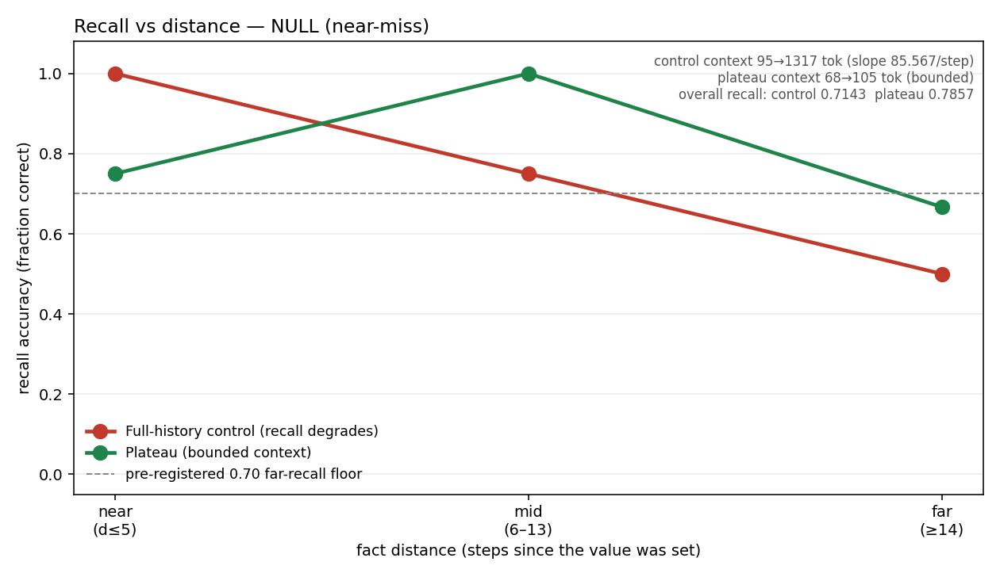

# Plateau

**Bounded, predictable context for long-horizon agents.** Carry a small, re-grounded
signal across steps instead of replaying the whole transcript. Context stays flat as the
task grows — and a stored fact stays one short line away instead of sinking into a
transcript the agent has to search.



*Measured, pure-recall task: as a fact sinks into history, the full-history control's
recall degrades (1.0 → 0.5) while it carries an ever-growing transcript (95 → 1,317
tokens). Plateau keeps the fact in a bounded signal (68 → 105 tokens) and recalls it
flatter and higher overall. Honest verdict below — this was a NULL (near-miss) by our own
pre-registered bar, not a clean win.*

## The idea

A long-running agent's scarcest resource is its context window. The naive loop carries
the full transcript forward, so context grows every step until the window fills and the
agent degrades. Plateau replaces *carry everything* with *carry a small re-grounded
signal*:

- At each step you **emit** a compact `RelationalState` — `open_goals`, `stance`,
  `lessons`, `pointers`, and gated `verified_facts`.
- At the next step you **inflate** that signal instead of the transcript, and **ground**
  it: every carried fact is re-checked against the live environment; anything reality no
  longer supports is dropped as **stale**.

The catch that keeps a bounded context *honest*: a fact may enter the signal only if it
passes **the gate** — backed by a `Measurement` that re-verifies right now. A model's own
assertion is never a measurement. Bounded context is cheap; the gate is what stops it from
filling with confident fabrications.

This measures **context efficiency** and **recall** — tokens carried, and whether a stored
fact can still be retrieved. It makes no claim about understanding or any inner state.

## Quickstart

```bash
pip install -e .
python examples/bare_loop.py        # the whole loop in plain Python, no agent framework
```

`bare_loop.py` runs an 8-step dependent computation carrying only the signal: the result
is correct, the emitted signal stays flat (328 → 329 bytes), the gate refuses an
ungrounded claim, and a tampered measurement is caught as stale — zero third-party deps.

## The receipts

Every number is produced by the same machinery, **sealed write-once before scoring**, and
**reproduced from the sealed file in a fresh process**. We report the verdict our own
pre-registered rule gives us — including where it denies us a win.

### Headline experiment — recall vs distance (`demo/`, pure recall, no arithmetic)

Pre-registration: [`demo/demo2_prereg.md`](demo/demo2_prereg.md) · sealed raw:
[`demo/raw2/`](demo/raw2/) · verdict: [`demo/verdict2.json`](demo/verdict2.json) ·
[full readout](demo/demo2_readout.md).

A long chain `SET`s verbatim values and later `QUERY`s them at increasing distance (steps
since the value was set). No arithmetic — a wrong answer can only be a memory failure.

| recall accuracy | near (d≤5) | mid (6–13) | far (≥14) | overall |
|---|---|---|---|---|
| full-history control | 1.00 | 0.75 | **0.50** | 0.71 |
| Plateau (bounded) | 0.75 | 1.00 | **0.67** | 0.79 |

**Verdict: `NULL (near-miss)`.** Full-history recall degrades clearly as facts sink
(1.00 → 0.50); Plateau is flatter and higher overall (0.79 vs 0.71) and beat control at
every distance bin except the near dip — **but its far-recall (0.67) did not clear the
0.70 floor we pre-registered**, so by our own locked rule this is **not a win**. The
directional result favors Plateau; we do not claim it. n is small (far bin = 6), and two of
Plateau's misses were it grabbing a top-of-file value rather than scanning to the target —
a presentation artifact, not distance decay. The honest next experiment is a larger n with
a cleaner register layout; we ship the NULL rather than tune until it crosses the line.

### Supporting — context cost is bounded (both demos, decisive)

The bounded-context half is unambiguous and reproduces in both demos: the full-history arm
carries an ever-growing transcript (here 95 → 1,317 tokens, ~85 tok/step) while Plateau
stays flat (68 → 105 tokens). That is the engineering benefit, and it holds regardless of
the recall verdict. An earlier arithmetic demo ([`demo/demo_prereg.md`](demo/demo_prereg.md),
[`demo/verdict.json`](demo/verdict.json), [chart](demo/context_per_step.png)) showed the
same token bound but had its completion axis confounded by arithmetic noise — which is
exactly why this recall-only demo exists.

See [`examples/continuum_story.md`](examples/continuum_story.md) for how this project's
discipline **killed its own headline hypothesis** and **caught its own fabricated "PASS"** —
the reason these receipts are worth reading. Integrity model: [`INTEGRITY.md`](INTEGRITY.md).

## Claude Code adapter

A thin adapter wires the core to a Claude Code session at the step boundary (pre-step
inflate+ground, post-step gate+emit). All logic stays in the core. See
[`adapters/claude_code/`](adapters/claude_code/).

## The condensation limit (stated plainly)

Plateau does **not** claim flat-forever recall. Its signal is bounded, so it can hold only
so much. Past the point where genuinely more distinct facts must be live than the signal
carries, recall MUST fall and real context has to be added back. These demos test recall of
facts that stay within the bounded file; they do not claim infinite compression. Plateau
bounds and re-grounds context; it does not abolish the need for context.

## What this is not

It measures context efficiency and recall — nothing about understanding, coherence, or any
inner state. And it does not make the model use the carried state perfectly; that depends
on the model.

## Layout

```
plateau/        core: signal (gate), continuum (emit/inflate/ground), metrics, integrity
examples/       bare_loop.py (host-free proof) + the continuum story
demo/           two pre-registered demos, sealed raw, verdicts, charts
adapters/       claude_code/ (thin SKILL.md + hook)
tests/          26 tests, core has zero third-party deps
```

## License

Apache-2.0. See [LICENSE](LICENSE).
