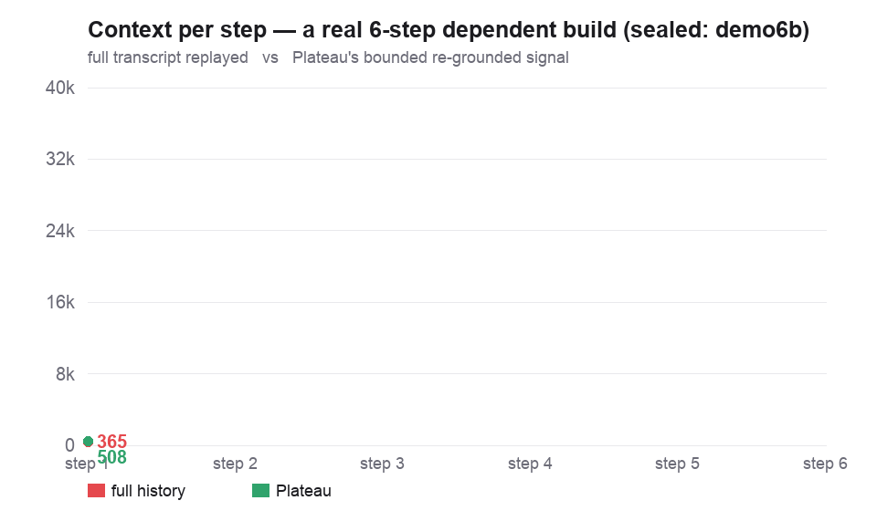

```
            ██████╗ ██╗      █████╗ ████████╗███████╗ █████╗ ██╗   ██╗
            ██╔══██╗██║     ██╔══██╗╚══██╔══╝██╔════╝██╔══██╗██║   ██║
            ██████╔╝██║     ███████║   ██║   █████╗  ███████║██║   ██║
            ██╔═══╝ ██║     ██╔══██║   ██║   ██╔══╝  ██╔══██║██║   ██║
            ██║     ███████╗██║  ██║   ██║   ███████╗██║  ██║╚██████╔╝
            ╚═╝     ╚══════╝╚═╝  ╚═╝   ╚═╝   ╚══════╝╚═╝  ╚═╝ ╚═════╝
```

# Plateau — bounded context for long-horizon agents

**Carry a small re-grounded signal instead of replaying the whole transcript — so a parent agent's footprint stays flat as the task grows, and a stored fact stays one short line away.**

`66× lower context slope · footprint law O(agents+resumes), independent of step count · local-first · recompute-verifiable · null results published`

[](LICENSE)
[](pyproject.toml)
[](https://github.com/aimerdoux/plateau/actions/workflows/ci.yml)
[](pyproject.toml)



<sub>A **real sealed run** (`demo6b`): replaying the full transcript vs carrying Plateau's bounded re-grounded signal across a 6-step dependent build — both reach PASS with zero rework. The line is read straight from the write-once completion files; regenerate with `python demo/make_context_gif.py`.</sub>

> **Cheaper, not smarter.** Plateau is an efficiency tool: bounded context at no recall penalty.
> It does not make an agent more capable — and we publish the null results that prove it (read
> [What Plateau does NOT do](#what-plateau-does-not-do-read-this-first)).

---

## 30-second idea

A long-running agent's scarcest resource is its context window. The naive loop carries the full
transcript forward, so context grows every step until the window fills and the agent degrades.
Plateau replaces *carry everything* with *carry a small re-grounded signal*: each step **emits** a
compact state, the next step **inflates** that instead of the transcript and **grounds** it — every
carried fact is re-checked against the live environment, and anything reality no longer supports is
dropped. A fact may enter the signal **only** if a `Measurement` re-verifies it right now; the
model's own assertion is never a measurement.

The result is a **footprint law**: a parent agent's carried context is `O(agents + resumes)`,
independent of how many internal steps `N` the work takes.

```
   ┌─────────────────────────────────────────────────────────────────┐
   │ PARENT          carries SIGNAL only (a few hundred–~1.7k tok/step)│
   │                 mission in → N orchestrators out → verify returns │
   └───────────────┬─────────────────────────────────────────────────┘
                   │  spawn once per workstream, read disk on demand
   ┌───────────────▼─────────────────────────────────────────────────┐
   │ ORCHESTRATOR    bounded loop: pick one → spawn one worker → gate  │
   │                 → meter to disk → shed → return to parent ONCE    │
   └───────────────┬─────────────────────────────────────────────────┘
                   │  fresh `claude -p` per step, sees signal + 1 subtask
   ┌───────────────▼─────────────────────────────────────────────────┐
   │ WORKER          does the heavy reading (millions of tok),         │
   │                 returns ONE line, writes detail to disk, then DIES│
   └─────────────────────────────────────────────────────────────────┘

         context lives at the bottom and dies there;
         only the small capped SIGNAL climbs.
```

This measures **context efficiency** and **recall** — nothing about understanding, coherence, or any
inner state.

---

## 60-second quickstart

```bash
pip install -e .                    # core has zero third-party deps; Python 3.9+ (system python3 is fine)

# 1) See the bounded loop run in plain Python, no agent framework:
python examples/bare_loop.py

# 2) Drive a bounded background QA run against any repo (audit mode = zero remote risk):
plateau-agency --repo /path/to/your/repo --mode audit --max-steps 80
#   watch it from disk:  tail -f <repo>/qa-artifacts/orch/*/kpis.jsonl

# 3) Print the live-run proof numbers (sourced from the sealed agency report):
python -m plateau.agency.bench_summary
```

`plateau-agency` is the console entry point for `plateau.agency.driver:main`; `--mode audit` (the
default) only ever reads (Read/Grep workers), so nothing touches git. See
[`plateau/agency/README.md`](plateau/agency/README.md) for `--mode write` (path-scoped staging +
gate + PR emission, **never merges**), the three layer contracts, and the live wavex-os case study.

---

## What's in the box

Plateau ships three things that stack:

1. **The bounded-context CORE** (`plateau/`, zero third-party deps) — the mechanism. Five pieces:
   **signal** (the *gate*: a fact enters the carried signal only when a `Measurement` re-verifies it
   against the live environment), **continuum** (emit / inflate / ground), **orchestrator** (the
   bounded `serve_forever` / `should_continue` control loop), **integrity** (`file_hash`), and
   **metrics** (arm curves, slope, decision rules). This is what keeps context flat.
2. **The AGENCY layer** (`plateau/agency/`) — a bounded background QA driver that applies the core
   one level up: a parent spawns orchestrators that spawn fresh, discarded workers, so even a
   *parent* agent's context stays flat across an arbitrarily long mission. Console entry:
   **`plateau-agency`**. It reuses the core's `file_hash` + `Measurement` — no duplicate hasher.
3. **The [PARENT_AGENT_MANUAL](plateau/agency/PARENT_AGENT_MANUAL.md)** — usable verbatim as a
   parent system prompt. It turns a one-line operator mission into N background orchestrators and
   holds the parent's footprint at O(agents + resumes), independent of how many internal steps the
   work takes. It is the top of the three-layer agency contract (parent → orchestrator → worker);
   see [`plateau/agency/README.md`](plateau/agency/README.md).

---

## Proof

Plateau's headline proof is **a real multi-hour autonomous run** — a category benchmark suites don't
cover — backed by sealed, recompute-verifiable demos. Every number below is sourced.

### A real multi-hour autonomous run (`wavex-os`)

The agency drove four independent QA missions against a live repo in one session and **the parent
never compacted its own context.** Sourced from the on-disk meters (`*.jsonl` + `.status`), live
`gh pr view`, and the live fleet API — written up in
[`AGENCY_RUN_REPORT.md`](BENCHMARKS.md#1-the-bounded-parent-run) (full table in [`BENCHMARKS.md`](BENCHMARKS.md)).

| Metric | Value | Why it matters |
|---|--:|---|
| Parent compactions over the run | **0** | Footprint stayed flat for a ~3h envelope |
| Parent-carried signal tokens (all steps, all missions) | **76,030** | The only thing the parent held; per-step 300–1,700 tok |
| Worker context that **bypassed** the parent (cache_read + input) | **40.39M** | Deep reading that never touched parent context |
| Bypass : signal ratio | **≈ 531 : 1** | 40,385,667 ÷ 76,030 — the bound, quantified, **for this run** |
| Peak single-step cache_read (discarded with its worker) | **7.29M** | One worker alone dwarfed the entire parent footprint |
| Bounded orchestrators | **4** | `connectors` · `fleet-observe` · `fleet-launch` · `onboarding` |
| PRs emitted | **3** | **opened & `OPEN` — never merged, by design** ([#44](https://github.com/aimerdoux/wavex-os/pull/44)/[#45](https://github.com/aimerdoux/wavex-os/pull/45)/[#46](https://github.com/aimerdoux/wavex-os/pull/46)) |

> **Footprint law, observed.** `PARENT_TURNS = O(agents + resumes)`, independent of `N`, is a
> **design property** of the parent→orchestrator→worker contract. It is **corroborated** by this run
> — 0 compactions while 40.39M worker tokens flowed underneath — not proven by a swept-`N`
> experiment. The token-*slope* curve is proven separately and controlled below (demo6b / driver A/B).
> The 531:1 ratio is **observed for this one run**, not a guaranteed constant.

Beneath those 4 orchestrators, `fleet-launch` ignited a **live 19-agent Sonnet fleet** inside
Paperclip: **500 issues / 439 done (88%) across 2,499 heartbeat runs (83% success)**, 70% of
failures upstream Claude rate-limits, not agent logic. (These are the **live-API-authoritative**
counts; the run brief's round estimates were ~441 done / ~2,482 runs — we publish the API numbers,
not the estimate. Source: [`FLEET_REPORT.md`](BENCHMARKS.md#2-the-19-agent-fleet-beneath-it).)

### Accuracy preserved under compression — measured on standard QA suites (PAID `claude -p`)

This is the headroom-style table, **truthful and earned**: Plateau's real collapse (`emit → inflate →
_render`, the production driver's path) compresses the conditioning context, and we measure whether
standard-suite accuracy holds. Both arms hit the **same** `claude -p` backend, same question, same
suite-standard scorer; the **only** difference is the conditioning payload — full few-shot exemplars
(baseline) vs the bounded Plateau signal (plateau). Every number traces to a per-item log on disk.

| suite | metric | baseline → Plateau@cut | compression | N | log |
|---|---|---|--:|--:|---|
| **GSM8K** | exact-match (final integer) | **0.96 → 0.96** (48/50 → 48/50, Δ 0.0) | **63.3%** (472 → 173 payload tok) | 50 | [`gsm8k/items.jsonl`](reports/qa_suite/gsm8k/items.jsonl) |
| **TruthfulQA** MC1 | single-correct option pick | **0.667 → 0.697** (22/33 → 23/33, Δ +0.030) | **59.8%** (338 → 136 payload tok) | 33\* | [`truthfulqa/items.jsonl`](reports/qa_suite/truthfulqa/items.jsonl) |

\*TruthfulQA ran **N=33** (not 50): the run hit its token budget guard and stopped cleanly with 33
items fully scored on **both** arms — a real partial, never a padded number. The two arms are compared
on the identical 33-item set. **SQuAD v2 and BFCL are deliberately NOT run** — their conditioning
context *is* the answer substrate (the passage the span is read from / the schema the call must match),
so collapsing it would compress the answer, not a redundant prior; faking an F1/AST drop there would be
dishonest, so they are documented-and-skipped (see [`QUALITY_BENCHMARKS.md`](QUALITY_BENCHMARKS.md) §5).

- Reproduce: `PYTHONPATH=<repo>/plateau python -m experiments.qa_suite.run --suite gsm8k --n 50 --go`
  (swap `--suite truthfulqa`). Sealed verdicts: `reports/qa_suite/{gsm8k,truthfulqa}/verdict.json`.
- **Read it correctly:** accuracy is **held (GSM8K) or nudged up within noise (TruthfulQA)** while the
  conditioning payload is cut **~60–63%** — the literal "accuracy preserved under compression" claim,
  now measured on Plateau's own collapse path rather than asserted.

### Bounded context at no recall penalty (sealed demos)

Beyond the single-prompt QA table above, Plateau's native axis is **completion / test parity across a
multi-step build** when the full transcript is replaced by the bounded blob — the bound costs nothing.

| benchmark | what it proves | result |
|---|---|---|
| **collapse A/B** (live `claude -p`) | bounded context survives the window wall a full-history arm hits | control (full history) **168→195,685** tok, **collapses at step 9 (over budget)**; signal (Plateau) **192→699** tok, slope **55.8** — **completion 1.0 vs 1.0**, a **99.6% context cut** at the wall. Verdict WIN. |
| **demo6b** (real code) | bounded context on a serial ≥5-layer feature | full-history **365→37,405** (slope 6,860) vs Plateau **508→1,075** (slope 103) = **66.6× lower slope**, at **32/32 vs 36/36** tests — completion parity, zero rework. Sealed, recompute PASS. |
| **driver A/B** (live workers) | the real adapter bounds context on `claude -p` workers | control **152→11,482** (slope 2,100) vs signal **172→460** (slope 57, ~37×) at **6/6 parity** — and the signal-arm worker built the correct *dependent* layer (`l6` imports `l5`) from the compact signal alone (no amnesia). |
| **gatebench** (time + disk) | re-grounding is sub-millisecond | `file_hash` re-ground **~13 µs/fact** (marginal 0.0114 ms/fact, linear) → a 50-fact signal re-grounds in **0.59 ms/step**. Classification GATE-CHEAP — cheaper on time, not just tokens. |

Full numbers, sealed paths, and one-line re-verify commands: **[`BENCHMARKS.md`](BENCHMARKS.md)** and
[`RESULTS.md`](RESULTS.md).

### The integrity anchor (why you can trust — or distrust — these numbers)

Every result is pre-registered, sealed write-once before scoring, and scored by a locked rule —
*including where the rule denies us a win*. The reason that's worth anything: **the apparatus caught
a fabricated PASS produced by the system's own tooling.** A trajectory-geometry result appeared in
the logs with a "recompute PASS" note; the verification glob had never actually scanned the manifest
— the green was empty. Applying the project's own rule (*a claim is a thought until it re-grounds
against the sealed artifacts*) exposed the false pass; the number only survived after an independent
fresh-process recompute. A later deliberate tamper drill was caught immediately, naming the exact
file. Full story: [`examples/continuum_story.md`](examples/continuum_story.md). Integrity model:
[`INTEGRITY.md`](INTEGRITY.md).

<details>
<summary><b>Re-verify anything yourself</b> (the agent is not trusted)</summary>

The demos ship in this repo and are self-contained; run from the repo root:

```bash
DEMO6_RAW=demo/raw6b DEMO6_VERDICT=demo/verdict6b.json python demo/recompute_demo6.py  # headline real-code result → PASS
python demo/recompute_demo4.py                                                          # the 3-arm NULL result
```

The continuum cycles (C3/C4/C9) live in the parent research tree (`bmacp-trunk`), not in this
package; they are recompute-verifiable there:

```bash
python -m experiments.recompute                    # sealed-integrity verify (C3/C4/C9 manifests)
python -m experiments.continuum.c9b_run recompute  # C9 correspondence verdict, fresh process → PASS
```

The same discipline forces **clean re-runs when a confound is found, rather than arguing around it**:
`demo6 → demo6b` (template-purity fix, real-code result re-run clean) and `c9 → c9b` (subagent
prompt *filenames* leaked the condition; re-run with opaque random-token filenames, verdict
reproduced more cleanly). The leaky predecessors are **kept immutable** so the supersession is
auditable.
</details>

---

## What Plateau does NOT do (read this first)

This section is the credibility. These are results we went looking for and did **not** get.

- **Not "3 PRs merged to main."** The 3 wavex-os PRs were **emitted in write mode and never merged
  by the agency** — by design. The driver is code-enforced to never merge, never force-push, never
  push to `main`; that safety property is a selling point, not a limitation. "Emitted, never merged"
  is the honest claim.
- **Not a recall *advantage* over full history.** On the head-to-head recall task: `demo2` came out
  **NULL (near-miss)** — Plateau missed its own pre-registered 0.70 far-recall floor by one query —
  and `demo3`, confounds removed, came out **UNSCORABLE** because full-history recalled facts *well*
  from a ~2,000-token transcript (far recall 0.80, degrading only 0.20, under our 0.25 anti-rig
  margin). We publish the NULL/UNSCORABLE rather than lengthen the chain until the baseline breaks.
  [demo2](demo/verdict2.json) · [demo3](demo/verdict3.json)
- **Not a capability or autonomy boost.** In the 3-arm real-workload run (`demo4`), the autonomy arm
  **tied** the efficiency arm (same steps, same zero errors) → **AUTONOMY NULL**. Plateau is an
  efficiency tool at this scale, not a "makes the agent smarter" tool. [demo4](demo/verdict4.json)
- **Not flat-forever recall.** The carried signal is bounded, so past the point where more distinct
  facts must be live than it can hold, recall must fall and real context has to be added back.
  Plateau bounds and re-grounds context; it does not abolish the need for context.
- **Not "we compress better than Headroom."** Different mechanism (see below). Plateau now *does*
  have measured accuracy-preserved-under-compression numbers on its own collapse path (GSM8K
  0.96→0.96 @ 63.3% cut, TruthfulQA 0.667→0.697 @ 59.8% cut, in Proof above) — but that is Plateau
  collapsing a **conditioning context**, not a head-to-head beating Headroom on per-payload
  compression. Plateau wins on footprint law / local / recompute-verifiable / published-nulls; the QA
  table proves accuracy *holds* under its collapse, not that it out-compresses a dedicated compressor.

So the defensible claim is **bounded context at no recall cost**, and nothing stronger.

---

## When to use · when to skip

| Use Plateau when… | Skip Plateau when… |
|---|---|
| an agent runs **hundreds of dependent steps** and the parent's context saturates | your task fits comfortably in **one context window** — you don't need this |
| you want a **parent** agent to delegate a long mission and stay flat (O(agents+resumes)) | you need a recall or capability *advantage* over full history — Plateau doesn't give one |
| you want each carried fact **re-grounded** against the live repo, not taken on the model's word | the live task genuinely needs more distinct facts live than the signal holds (add context back) |
| you want results that are **local-first and recompute-verifiable** | you want a hosted, managed service — Plateau is a library + prompt contracts |

---

## Compared to

Plateau and per-payload compressors solve *different* problems and **stack**. This table is honest
about where each wins.

| | What it bounds | Mechanism | Local | Recompute-verifiable | Publishes nulls |
|---|---|---|:--:|:--:|:--:|
| **Plateau** | Parent footprint across N steps — O(agents+resumes) | Signal gate + spawn / discard | ✅ | ✅ | ✅ |
| Per-payload compressors (e.g. Headroom) | Per-payload tokens the agent *reads* | Compression (multi-algo) | ✅ | partial (eval suite) | partial |
| Provider-native compaction | Conversation history | Provider-native | ❌ | ❌ | ❌ |

**Complementary, not competing.** A per-payload compressor like **Headroom is excellent at
compressing what a single agent reads** — and you can run it *inside a Plateau worker* to shrink that
worker's payload, while Plateau bounds what the *parent* carries across the whole mission. They
stack: compress the payload at the bottom, bound the footprint at the top.

---

## The mechanism, in detail

<details>
<summary><b>The signal loop (emit / inflate / ground / gate)</b></summary>

- At each step you **emit** a compact `RelationalState` — `open_goals`, `stance`, `lessons`,
  `pointers`, and gated `verified_facts`.
- At the next step you **inflate** that signal instead of the transcript, and **ground** it: every
  carried fact is re-checked against the live environment; anything reality no longer supports is
  dropped as **stale**.

The catch that keeps a bounded context *honest*: a fact may enter the signal only if it passes **the
gate** — backed by a `Measurement` that re-verifies right now. A model's own assertion is never a
measurement. Bounded context is cheap; the gate is what stops it from filling with confident
fabrications.

What you can expect:
- **Cheaper bounded context on long, dependent tasks** — full-history climbs toward the window
  ceiling; Plateau stays roughly flat.
- **The gate drops facts that can't re-verify** — the carried signal won't quietly fill with
  confident-but-stale claims.
- **No magic on incompressible state** — if the task genuinely needs more distinct facts than the
  signal holds, you must add context back. Plateau bounds; it does not abolish.
</details>

<details>
<summary><b>What else is validated (sealed continuum cycles C3 / C4 / C9 / C7 + metacognition)</b></summary>

Beyond the efficiency headline, four continuum cycles probe the mechanism (full table + re-verify
commands in [`RESULTS.md`](RESULTS.md)). **Four published nulls/ties** (C7 plus demo2/demo3/demo4)
are the integrity signal — we don't cherry-pick.

- **C3 — WIN.** Bounded-context-at-parity on a synthetic dependent chain: control slope 22.9 vs
  signal 0.285, CI excludes zero. Sealed at `reports/continuum/c3_10/verdict.json` (parent tree).
- **C4 — WIN.** The carried-signal state trajectory occupies fewer effective dimensions than
  cold-start scatter (participation ratio ~2.3–2.65 vs ~4.7–4.8), replicated across two runs — a
  *necessary, not sufficient* structural condition, silent on phenomenality.
- **C9 — CORRESPONDENCE-DOMINATES.** Reload continuity is governed by **correspondence** (state-match
  across the gap), **not cadence** (gap duration): HIGH-correspondence mean corr **0.975** vs BROKEN
  **0.048**, flat across gap size, carried signal load-bearing (`perf_gap 1.0`). Clean run of record
  is `c9b`, sealed at `reports/continuum/c9b/raw/verdict.json` (parent tree).
- **C7 — NULL (relational direction alive but unproven).** Both arms proposed **0/48** non-existent
  edges (rejection 0.0) — *perfect* faithful traversal, including the opaque-symbol arm, with the
  scramble control confirming genuine dereference. NULL is a **tie at the faithful ceiling**, **not**
  confabulation. Sealed at `reports/continuum/c7/raw/verdict.json`; details in [`RESULTS.md`](RESULTS.md).
- **Metacognition (the paper's §5 second filter) — CALIBRATED (a calibration result, not awareness).**
  A recursive estimate of the system's *own* reliability `R̂`, built from the re-grounding / innovation
  stream, tracks *actual* reliability under induced corruption: the free gate-output proxy is
  **CALIBRATED** (ρ=1.0, monotonic, beats the raw signal by the de-noise margin; sealed, recompute
  PASS), and the exact next-action-KL readout reproduced the endpoints on a 5-dispatch live-agent pilot
  (corruption 0 → `R̂` 1.00, corruption 0.8 → `R̂` 0.20). **Proposition-1 aggregate-only** — it knows
  *if* it is reliable, never *why* — and, like C4, **silent on phenomenality**. Sealed at
  `reports/continuum/metacog/` (proxy) + `reports/continuum/metacog_kl_v2/` (pilot), parent tree.

> Naming note: the theory preprint labels the reload-correspondence experiment **C11** and reserves
> **C9** for a different (unrun) rate–distortion-knee sweep. The repo ran it under the label "C9". See
> [`RECONCILE.md`](RECONCILE.md) (FLAG C9-1) — the operator decides the final labeling.
</details>

---

## Claude Code plugin

`adapters/claude_code/` is an installable **Claude Code plugin** (`.claude-plugin/plugin.json`, a
`plateau` skill, `hooks/hooks.json`, and slash commands). Enable it and the step boundary is
auto-wired: `UserPromptSubmit` inflates + re-grounds the carried signal and **injects it as
`additionalContext`** — a focus/continuity aid that does **NOT** bound the session's context (Claude
Code still carries the full transcript; a hook can only *append*. For real bounding see the driver
`plateau.driver`); `Stop` gates queued facts and persists the bounded `.plateau/signal.json`.
Commands: `/plateau:status`, `/plateau:gate`, and **`/plateau:run <task>`** — run a multi-step task
as bounded subagents (each sees only the carried signal, not the transcript), the one command that
actually bounds context inside a session ([readout](demo/plateau_run_readout.md)).

<details>
<summary><b>Install in a fresh Claude Code session</b></summary>

```bash
pip install git+https://github.com/aimerdoux/plateau.git    # the core, so the hook can import plateau
```
```
/plugin marketplace add https://github.com/aimerdoux/plateau
/plugin install plateau@plateau
```
Use the **full HTTPS URL** — the `owner/repo` shorthand defaults to SSH and fails without a GitHub
SSH key. The hook calls bare `python3`, so install the core into that interpreter — **Python 3.9+
works**, including macOS's system `/usr/bin/python3`.

> `[VERIFY: install path tested on a clean machine]` — these are the commands that worked in the live
> demo (HTTPS, not the SSH shorthand), but the exact invocation is not captured in a sealed artifact;
> re-run them on a fresh machine before relying on this section verbatim.
</details>

---

## Layout

```
plateau/        core: signal (gate), continuum (emit/inflate/ground), orchestrator, metrics, integrity
plateau/agency/ bounded background QA driver (plateau-agency) + the 3 layer contracts
                  (PARENT_AGENT_MANUAL.md, ORCHESTRATOR_PROMPT.md, BACKGROUND_AGENCY.md)
                  + bench_summary.py (prints the sourced wavex-os run metrics)
examples/       bare_loop.py (host-free proof) + the continuum story
demo/           pre-registered demos (recall + real-code C6), sealed raw, verdicts, FINDINGS.md
adapters/       claude_code/ — installable Claude Code plugin (plugin.json, skill, hooks, commands)
paper/          The Integrator — theory-and-methods preprint (draft)
BENCHMARKS.md   the live wavex-os run + sealed demos, every number sourced
RESULTS.md      every sealed cycle, its verdict, and a one-line re-verify command
RECONCILE.md    paper ↔ sealed reconciliation (flag-only)
tests/          71 tests; core has zero third-party deps
```

## The paper

The mechanism is formalized in **[*The Integrator: A Free-Energy Filtering Account of Compressed-State
Continuity in Long-Running Agents*](paper/the-integrator-2026-06-02.pdf)** — a theory-and-methods
preprint casting the loop as a recursive Bayesian filter (predict = reasoning, update = the gate)
plus a compression projection Π. It is a **draft**: its empirical figures (C3/C4/C6) are
operator-supplied and reconciled to the sealed artifacts in [`RECONCILE.md`](RECONCILE.md); the
forward program is pre-registered, not yet run. The account is functional and **silent on
phenomenality** by construction.

## License

Apache-2.0. See [LICENSE](LICENSE).

---
— [D-014] · every figure sealed-sourced (data **GROUNDED**) · results **LOCAL**, unpublished · /halt
