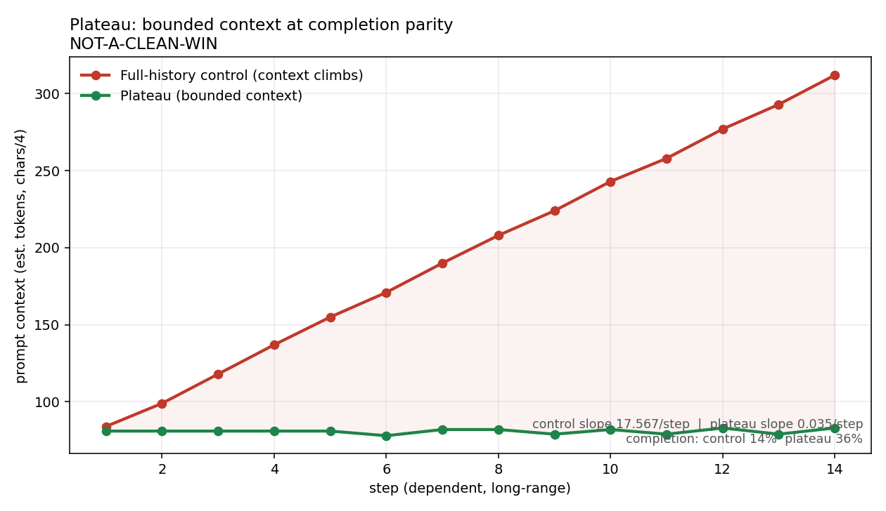

# Plateau

**Bounded, predictable context for long-horizon agents.** Carry a small, re-grounded
signal across steps instead of replaying the whole transcript. Context stays flat; the
agent can run long without climbing toward the context ceiling.



*Measured, 14-step dependent task: the full-history arm's context climbs ~17.6 tokens/step
(84 → 312) while Plateau holds flat at ~0.035 tokens/step (81 → 83). [Sealed data + full
readout below.](#the-receipts)*

## The idea

A long-running agent's scarcest resource is its context window. The naive loop carries
the full history forward, so context grows every step until the window fills and the
agent degrades or dies. Plateau replaces *carry everything* with *carry a small
re-grounded signal*:

- At each step you **emit** a compact `RelationalState` — `open_goals`, `stance`,
  `lessons`, `pointers`, and gated `verified_facts`.
- At the next step you **inflate** that signal instead of the transcript, and **ground**
  it: every carried fact is re-checked against the live environment; anything reality no
  longer supports is flagged **stale** and dropped.

The catch that keeps a bounded context *honest*: a fact may enter the signal only if it
passes **the gate** — it must be backed by a `Measurement` that re-verifies right now.
A model's own assertion is never a measurement. Bounded context is cheap; the gate is
what stops it from quietly filling with confident fabrications.

## Quickstart

```bash
pip install -e .
python examples/bare_loop.py        # the whole loop in plain Python, no agent framework
```

`bare_loop.py` runs an 8-step dependent computation carrying only the signal: the final
result is correct, the emitted signal stays flat (328 → 329 bytes), the gate refuses an
ungrounded claim, and a tampered measurement is caught as stale — all with zero
third-party dependencies.

```python
from plateau import RelationalState, SelfState, Thought, Measurement, emit, inflate, apply_gate

sig = RelationalState(open_goals=["ship the parser"], stance="test-first")
# ... do a step, propose a fact backed by something re-readable ...
m = Measurement("file_hash", "build.ok", "<sha256>")
new = apply_gate(SelfState(sig, [Thought("build passes", m)]))  # only grounded facts admitted
blob = emit(SelfState(signal=new))                              # compact, bounded
state = inflate(blob).state                                     # re-grounded next step
```

## The receipts

Every number here is produced by the same machinery, sealed write-once before scoring,
and reproduced from the sealed file in a fresh process. We report the verdict our own
pre-registered rule gives us — including where it denies us a clean win.

- **Pre-registration** (written before the run): [`demo/demo_prereg.md`](demo/demo_prereg.md)
- **Sealed raw + manifest**: [`demo/raw/`](demo/raw/)
- **Verdict** (rendered from sealed data): [`demo/verdict.json`](demo/verdict.json)
- **Full readout**: [`demo/demo_readout.md`](demo/demo_readout.md)

**What is proven:** context efficiency. Full-history context climbs at 17.6 tok/step and
would cross a 200k budget in ~11k steps; Plateau's slope is ~0.035 tok/step — effectively
flat, ~never. Slope-difference 95% CI `[17.31, 17.75]` excludes zero.

**Honest failure mode — read this.** In the demo, Plateau answered 36% of the dependent
steps correctly vs the control's 14% — Plateau *beat* full-history — but **neither arm
cleared the 90% completion floor we pre-registered**, so by our own locked rule this is a
**`NOT-A-CLEAN-WIN`**, not a win. The cause was an instrument confound: the toy subagents
made frequent arithmetic slips that cascade under GOLD-vs-error-propagation scoring, on
*both* arms. (One genuine long-context pathology did show up: the full-history control
**perseverated**, repeating a stale answer as its transcript filled, and on a long-range
recall step it returned a value from 10 steps earlier's *seed* instead of the current
one — exactly the failure bounded context avoids.) A recall-only task would isolate the
mechanism from arithmetic noise; that's the honest next experiment. We ship the demo that
denied us a clean headline because that's the one worth trusting.

See [`examples/continuum_story.md`](examples/continuum_story.md) for how this project's
discipline once **killed its own headline hypothesis** and **caught its own fabricated
"PASS"** — the reason these receipts are worth reading.

## Claude Code adapter

A thin adapter wires the core to a Claude Code session at the step boundary
(pre-step inflate+ground, post-step gate+emit). All logic stays in the core.
See [`adapters/claude_code/`](adapters/claude_code/).

## What this is not

Plateau bounds context and keeps only re-grounded state. It does not make the model use
that state perfectly, and it makes **no claim about understanding or any inner state** —
it measures context efficiency, nothing more.

## Layout

```
plateau/        core: signal (gate), continuum (emit/inflate/ground), metrics, integrity
examples/       bare_loop.py (host-free proof) + the continuum story
demo/           pre-registration, harness, sealed raw, verdict, hero chart
adapters/       claude_code/ (thin SKILL.md + hook)
tests/          26 tests, core has zero third-party deps
```

## License

Apache-2.0. See [LICENSE](LICENSE).
